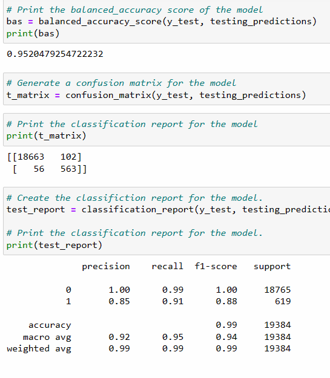
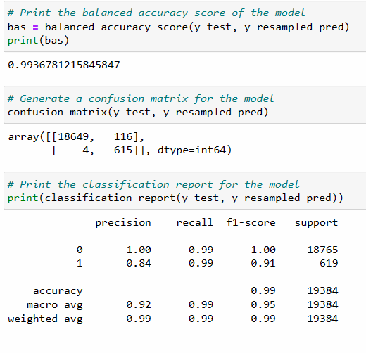

# Credit-risk-classification

## Purpose of the analysis
The purpose is to provide the company with the best model for predicting which customers are going to be the least risk to them, when lending.

## Metrics
See images below for the metrics.

### Imbalanced without oversampling
The model is giving us a high accuracy of 95%, however, the recall for the risky loans is 91% whereas the recall for healthy loans is 99%. This could mean for 9% of loans approved, they could in fact be unhealthy/risky customers.

### With oversampling
We have removed the initial bias that the imbalanced data was showing in the first model. This has also helped us to reduce the false negatives for the risky loans (gone from 56 to 4) and ultimately improved the recall from 91% to 99%

## Summary and conclusion of findings
Based on the above results, I would recommend using the second model i.e. with the oversample training data, for use by the company. As it gave the hihger recall value for risky loans, it would be more pertinent to use this for the avoidance of handing loans to risky customers.

